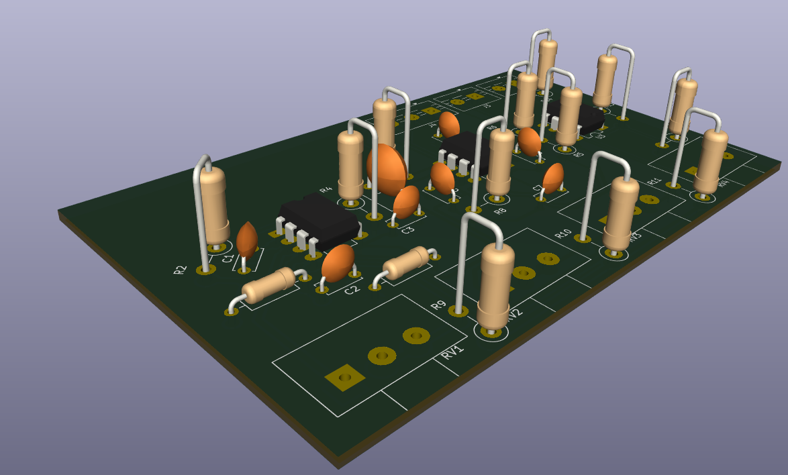

# Three Band EQ 

A three-band equalizer is a type of audio filter that allows users to adjust the levels of three different frequency bands: low, mid, and high. This project implements a three-band equalizer using analog circuitry, specifically designed for audio applications.

## Directory structure
```
├── design
│   ├── KicadDesign
│   │   ├── KicadDesign.kicad_pcb
│   │   ├── KicadDesign.kicad_prl
│   │   ├── KicadDesign.kicad_pro
│   │   ├── KicadDesign.kicad_sch
│   │   └── MFG_EQ.pdf
│   ├── readme.md
├── doc
│   └── readme.md
├── README.md
└── sim
    ├── EQ.asc
    ├── EQ.op.raw
    ├── EQ.raw
    ├── EQreal.asc
    ├── EQreal.op.raw
    ├── EQreal.raw
    ├── tl072.cir

```

- `KicadDesign.kicad_sch` / `.kicad_pcb` / `.kicad_pro` — KiCad design
- `KicadDesign.step` — 3D model
- `MFG_EQ.pdf` — design writeup
- `EQ.asc` — LTspice simulation




## Files

## Credit
Built as coursework with [DasReyxr](https://github.com/DasReyxr)  and [Kevin Lara](https://github.com/Gyonyu) 


## Template
```
mkdir code design doc scripts sim src
```

```
tree >> README.md
```
